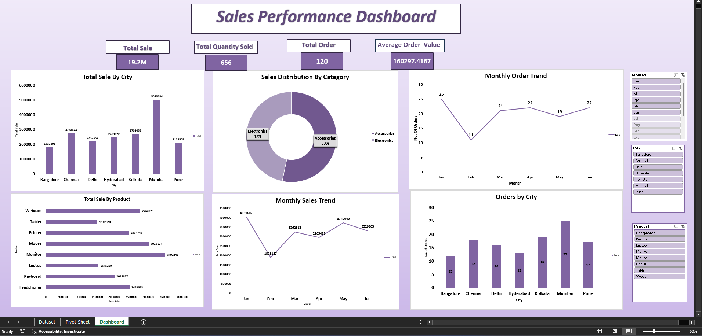

 📊 Sales Performance Dashboard (Excel)

📌 Project Overview
This project analyzes sales data to generate business insights using Microsoft Excel.

🛠 Tools Used
- Microsoft Excel
- Pivot Tables
- Charts & Graphs

🔍 Insights
- Identified top-performing products and regions
- Analyzed monthly sales growth patterns
- Highlighted profit and loss areas
- 
📊 Key Features
- Interactive dashboard
- Sales & profit analysis
- Region-wise performance

 📸 Dashboard Preview

🚀 Conclusion
This dashboard helps understand sales trends and improve decision-making.
